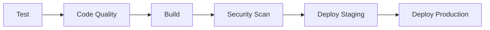

# CI/CD Pipeline Documentation

This directory contains comprehensive GitHub Actions workflows for the Astronomical Data Processing Pipeline, providing enterprise-grade continuous integration, deployment, and operational excellence.

## 🚀 Overview

The CI/CD pipeline consists of multiple specialized workflows designed for different aspects of software delivery:

| Workflow | Purpose | Trigger | Duration |
|----------|---------|---------|----------|
| `ci-cd-pipeline.yml` | Main application build, test, and deployment | Push/PR to main/develop | ~15-25 min |
| `terraform-infrastructure.yml` | Infrastructure management and deployment | Terraform changes | ~10-20 min |
| `security-scan.yml` | Comprehensive security vulnerability scanning | Push/PR + daily schedule | ~20-30 min |
| `performance-testing.yml` | Load, stress, and performance validation | Push to main + nightly | ~30-45 min |

## 🏗️ Workflow Architecture

### 1. Main CI/CD Pipeline (`ci-cd-pipeline.yml`)

**Purpose**: Core application lifecycle management with astronomical data processing focus

**Key Features**:
- **Multi-language Testing**: Java (Gradle) and Python test execution
- **Code Quality**: SonarCloud, Checkstyle, SpotBugs analysis
- **Container Building**: Multi-arch Docker images for image-processor and catalog-service
- **Security Integration**: Trivy and Snyk vulnerability scanning
- **Progressive Deployment**: Staging → Production with health checks
- **Blue-Green Deployment**: Zero-downtime production deployments

**Stages**:


**Environment Variables Required**:
```bash
AWS_ACCESS_KEY_ID          # AWS access credentials
AWS_SECRET_ACCESS_KEY      # AWS secret key
SONAR_TOKEN               # SonarCloud authentication
SNYK_TOKEN                # Snyk security scanning
SLACK_WEBHOOK_URL         # Deployment notifications
```

### 2. Terraform Infrastructure (`terraform-infrastructure.yml`)

**Purpose**: Infrastructure as Code management with security validation

**Key Features**:
- **Multi-Environment**: Separate staging and production workflows
- **Security Scanning**: Checkov, TFSec, TFLint validation
- **Plan Validation**: Terraform plan review before apply
- **State Management**: Remote state with DynamoDB locking
- **Approval Gates**: Manual approval for destructive operations

**Workflow Stages**:
```mermaid
graph TD
    A[Validate] --> B[Security Scan]
    B --> C[Plan Staging]
    C --> D[Plan Production]
    D --> E[Apply Staging]
    E --> F[Apply Production]
    F --> G[Destroy \n(Manual Only)]
```

**Required Secrets**:
```bash
TERRAFORM_STATE_BUCKET    # S3 bucket for state storage
TERRAFORM_STATE_TABLE     # DynamoDB table for state locking
DESTROY_APPROVERS         # GitHub usernames for destroy approval
```

### 3. Security Scanning (`security-scan.yml`)

**Purpose**: Comprehensive security vulnerability assessment

**Security Layers**:
- **Dependency Scanning**: OWASP Dependency Check, Snyk, Safety
- **Static Code Analysis**: CodeQL, Semgrep, SpotBugs, Bandit
- **Container Security**: Trivy, Grype, Docker Scout
- **Infrastructure Security**: Checkov, TFSec, Kubesec
- **Secrets Detection**: TruffleHog, GitLeaks, detect-secrets
- **Compliance**: Open Policy Agent (OPA) policy validation

**Security Tools Matrix**:
| Language/Type | Primary Tool | Secondary Tool | Policy Engine |
|---------------|--------------|----------------|---------------|
| Java | SpotBugs + CodeQL | Snyk | SonarQube |
| Python | Bandit + CodeQL | Safety | Semgrep |
| Containers | Trivy | Grype + Scout | Checkov |
| Infrastructure | Checkov | TFSec | OPA Conftest |
| Secrets | TruffleHog | GitLeaks | detect-secrets |

### 4. Performance Testing (`performance-testing.yml`)

**Purpose**: Load, stress, and performance validation for astronomical workloads

**Test Types**:
- **Load Testing**: Normal operational load simulation with Locust
- **Stress Testing**: Peak load and breaking point analysis with k6
- **Database Performance**: Spatial query optimization and bulk operations
- **Endurance Testing**: Extended runtime stability validation

**Performance Metrics**:
```yaml
SLA Targets:
  Response Time (p95): < 2000ms
  Error Rate: < 5%
  Throughput: > 100 req/s
  Database Query Time: < 100ms
  Cone Search Performance: < 50ms
  Bulk Insert Rate: > 1000 records/s
```

## 📋 Workflow Configuration

### Branch Strategy

```yaml
Branches:
  main:        # Production deployments
    - Full CI/CD pipeline
    - Security scanning
    - Performance testing
    - Production deployment
    
  develop:     # Staging deployments
    - Full CI/CD pipeline
    - Security scanning
    - Staging deployment
    
  feature/*:   # Feature development
    - Testing and code quality
    - Security scanning
    - No deployment
```

### Environment Management

#### Staging Environment
- **Purpose**: Integration testing and validation
- **Deployment**: Automatic on `develop` branch
- **Resources**: Scaled-down infrastructure
- **Data**: Synthetic test data

#### Production Environment
- **Purpose**: Live astronomical data processing
- **Deployment**: Automatic on `main` branch (with approval gates)
- **Resources**: Full-scale, high-availability
- **Data**: Production astronomical data

### Secrets Management

**GitHub Repository Secrets**:
```bash
# AWS Configuration
AWS_ACCESS_KEY_ID=AKIA...
AWS_SECRET_ACCESS_KEY=...
AWS_REGION=us-east-1

# Security Tools
SONAR_TOKEN=...
SNYK_TOKEN=...
SNYK_ORG_ID=...

# Infrastructure
TERRAFORM_STATE_BUCKET=astro-terraform-state
TERRAFORM_STATE_TABLE=terraform-locks
DESTROY_APPROVERS=user1,user2

# Notifications
SLACK_WEBHOOK_URL=https://hooks.slack.com/...
```

**Environment-Specific Secrets**:
```bash
# Staging Environment
staging:
  DATABASE_URL: ...
  EKS_CLUSTER_NAME: astro-data-pipeline-eks-staging
  
# Production Environment  
production:
  DATABASE_URL: ...
  EKS_CLUSTER_NAME: astro-data-pipeline-eks
```

## 🔧 Local Development Workflow

### Pre-commit Setup
```bash
# Install pre-commit hooks
pip install pre-commit
pre-commit install

# Run checks manually
pre-commit run --all-files
```

### Testing Before Push
```bash
# Run unit tests
cd application/image-processor && ./gradlew test
cd application/catalog-service && ./gradlew test

# Run security checks
./gradlew dependencyCheckAnalyze
bandit -r application/data-simulator/

# Validate Terraform
cd terraform && terraform validate
```

### Local Container Testing
```bash
# Build containers locally
docker build -t astro-image-processor:local application/image-processor/
docker build -t astro-catalog-service:local application/catalog-service/

# Run security scans
trivy image astro-image-processor:local
trivy image astro-catalog-service:local
```

## 📊 Monitoring and Observability

### Pipeline Metrics

**Success Metrics**:
- Build success rate > 95%
- Deployment frequency (daily)
- Lead time for changes < 1 hour
- Mean time to recovery < 30 minutes

**Quality Gates**:
- Code coverage > 80%
- Security vulnerabilities = 0 critical
- Performance regression < 10%
- Infrastructure compliance = 100%

### Notification Channels

| Event Type | Channel | Audience |
|------------|---------|----------|
| Build Failures | `#ci-cd-alerts` | Development Team |
| Security Issues | `#security` | Security Team |
| Production Deploys | `#production-deployments` | Operations Team |
| Performance Issues | `#performance` | SRE Team |
| Infrastructure Changes | `#infrastructure` | Platform Team |

## 🚨 Troubleshooting Guide

### Common Issues

#### Build Failures
```bash
# Check test failures
gh run view --log-failed

# Rerun failed jobs
gh run rerun --failed

# Debug container builds
docker build --no-cache -t debug-image .
```

#### Security Scan Failures
```bash
# Review vulnerability reports
gh api repos/:owner/:repo/code-scanning/alerts

# Check dependency updates
./gradlew dependencyUpdates

# Update vulnerable dependencies
./gradlew useLatestVersions
```

#### Deployment Issues
```bash
# Check Kubernetes deployment status
kubectl rollout status deployment/image-processor -n astro-pipeline

# View application logs
kubectl logs -f deployment/image-processor -n astro-pipeline

# Rollback deployment
kubectl rollout undo deployment/image-processor -n astro-pipeline
```

#### Performance Test Failures
```bash
# Check resource constraints
kubectl top pods -n astro-pipeline

# Review performance metrics
kubectl port-forward svc/grafana 3000:3000 -n astro-pipeline

# Scale resources if needed
kubectl scale deployment image-processor --replicas=5 -n astro-pipeline
```

## 🔄 Workflow Customization

### Adding New Tests
```yaml
# Add to ci-cd-pipeline.yml
- name: Custom Test Suite
  run: |
    cd application/your-service
    ./gradlew customTest
```

### Custom Security Policies
```bash
# Create .github/policies/security.rego
package security

deny[msg] {
  input.kind == "Deployment"
  input.spec.template.spec.securityContext.runAsUser == 0
  msg := "Containers must not run as root"
}
```

### Performance Test Extensions
```python
# Add to performance-testing workflow
class CustomAstroTest(HttpUser):
    @task
    def custom_processing_test(self):
        # Your custom test logic
        pass
```

## 📈 Best Practices

### Code Quality
- Maintain test coverage above 80%
- Fix security vulnerabilities immediately
- Use semantic versioning for releases
- Follow conventional commit messages

### Security
- Scan all dependencies regularly
- Use least-privilege access patterns
- Encrypt sensitive data at rest and in transit
- Regularly rotate secrets and credentials

### Performance
- Establish performance baselines
- Monitor key metrics continuously  
- Test with realistic astronomical data
- Implement graceful degradation

### Operations
- Implement comprehensive monitoring
- Maintain deployment rollback procedures
- Document incident response procedures
- Conduct regular disaster recovery tests

## 🔮 Future Enhancements

### Planned Improvements
- **GitOps Integration**: ArgoCD for declarative deployments
- **Advanced Testing**: Chaos engineering with Chaos Monkey
- **ML Pipeline**: Automated model training and deployment
- **Multi-Cloud**: Azure and GCP deployment options
- **Edge Computing**: Edge node deployment capabilities

### Scaling Considerations
- **Global Deployment**: Multi-region active-active setup
- **Data Pipeline**: Stream processing with Apache Kafka
- **Microservices**: Service mesh with Istio
- **Observability**: Distributed tracing with Jaeger

This CI/CD pipeline provides enterprise-grade automation specifically designed for astronomical data processing workloads, ensuring reliability, security, and performance at scale.